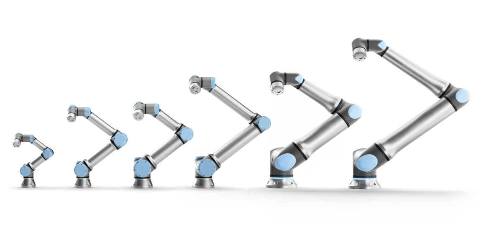

# Universal Robots ROS2 Driver

A Universal Robots se tornou uma fornecedora dominante de manipuladores robóticos leves para a indústria, bem como para pesquisa científica e educação.
<center></center>

Este é um dos primeiros drivers de manipulador ROS2. Alguns dos novos recursos são habilitados pelo ROS2 e incluem latência reduzida, segurança aprimorada e mais flexibilidade em relação à configuração do middleware. O pacote contém arquivos de inicialização para começar a usar o driver rapidamente como uma versão autônoma ou em combinação com o MoveIt2.

Este driver foi desenvolvido com base na [Universal_Robots_Client_Library](https://github.com/UniversalRobots/Universal_Robots_Client_Library) e oferece suporte a algumas funcionalidades essenciais do cobot, como: pausa em parada de emergência, parada de proteção, escalonamento automático de velocidade para evitar violação da configuração de segurança e escalonamento manual de velocidade do teach pendant. Além disso, o externalControl URCap possibilita incluir comportamentos ROS2 no programa do robô.

O driver é compatível com toda a linha de robôs UR — de 3 kg de carga útil a 30 kg de carga útil, e inclui todos os robôs da série CB3 e mais recentes.


Confira também [apresentações e vídeos](ur_robot_driver/doc/resources/README.md) sobre este driver.

## Release Status

<table width="100%">
  <tr>
    <th>ROS2 Distro</th>
    <th>Foxy (EOL)</th>
    <th>Galactic (EOL)</th>
    <th>Humble</th>
    <th>Iron</th>
    <th>Rolling</th>
  </tr>
  <tr>
    <th>Branch</th>
    <td><a href="https://github.com/UniversalRobots/Universal_Robots_ROS2_Driver/tree/foxy">foxy</a></td>
    <td><a href="https://github.com/UniversalRobots/Universal_Robots_ROS2_Driver/tree/galactic">galactic</a></td>
    <td><a href="https://github.com/UniversalRobots/Universal_Robots_ROS2_Driver/tree/humble">humble</a></td>
    <td><a href="https://github.com/UniversalRobots/Universal_Robots_ROS2_Driver/tree/iron">iron</a></td>
    <td><a href="https://github.com/UniversalRobots/Universal_Robots_ROS2_Driver/tree/main">main</a></td>
  </tr>
  <tr>
    <th>Release status</th>
    <td>
      <a href="https://github.com/UniversalRobots/Universal_Robots_ROS2_Driver/actions/workflows/foxy-binary-build.yml?query=event%3Aschedule++">
         
      </a> <br />
    </td>
    <td>
      <a href="https://github.com/UniversalRobots/Universal_Robots_ROS2_Driver/actions/workflows/galactic-binary-build.yml?query=event%3Aschedule++">
         
      </a> <br />
    </td>
    <td>
      <a href='https://build.ros2.org/job/Hbin_uJ64__ur_calibration__ubuntu_jammy_amd64__binary/'></a><br/>
      <a href='https://build.ros2.org/job/Hbin_uJ64__ur_controllers__ubuntu_jammy_amd64__binary/'></a>
      <a href='https://build.ros2.org/job/Hbin_uJ64__ur_dashboard_msgs__ubuntu_jammy_amd64__binary/'></a>
      <a href='https://build.ros2.org/job/Hbin_uJ64__ur_moveit_config__ubuntu_jammy_amd64__binary/'></a>
      <a href='https://build.ros2.org/job/Hbin_uJ64__ur_robot_driver__ubuntu_jammy_amd64__binary/'></a>
    </td>
    <td>
      <a href='https://build.ros2.org/job/Ibin_uJ64__ur_calibration__ubuntu_jammy_amd64__binary/'></a><br/>
      <a href='https://build.ros2.org/job/Ibin_uJ64__ur_controllers__ubuntu_jammy_amd64__binary/'></a>
      <a href='https://build.ros2.org/job/Ibin_uJ64__ur_dashboard_msgs__ubuntu_jammy_amd64__binary/'></a>
      <a href='https://build.ros2.org/job/Ibin_uJ64__ur_moveit_config__ubuntu_jammy_amd64__binary/'></a>
      <a href='https://build.ros2.org/job/Ibin_uJ64__ur_robot_driver__ubuntu_jammy_amd64__binary/'></a>
    </td>
    <td>
      <a href='https://build.ros2.org/job/Rbin_uJ64__ur_calibration__ubuntu_jammy_amd64__binary/'></a><br/>
      <a href='https://build.ros2.org/job/Rbin_uJ64__ur_controllers__ubuntu_jammy_amd64__binary/'></a>
      <a href='https://build.ros2.org/job/Rbin_uJ64__ur_dashboard_msgs__ubuntu_jammy_amd64__binary/'></a>
      <a href='https://build.ros2.org/job/Rbin_uJ64__ur_moveit_config__ubuntu_jammy_amd64__binary/'></a>
      <a href='https://build.ros2.org/job/Rbin_uJ64__ur_robot_driver__ubuntu_jammy_amd64__binary/'></a>
    </td>
  </tr>
</table>

A tabela acima mostra o status da compilação para cada pacote deste repositório do [ROS buildfarm](https://build.ros2.org/). Para distribuições de fim de vida (EOL), as compilações binárias noturnas do nosso CI são mostradas. As distribuições de EOL não receberão mais atualizações e podem estar sem recursos.

Um [status de construção mais detalhado](ci_status.md) mostra o estado de todos os fluxos de trabalho de CI dentro deste repositório.
Observe que a visualização detalhada é destinada a desenvolvedores, enquanto a aqui deve dar aos usuários finais
uma visão geral do estado atual de lançamento.

## Pacotes no Repositório:

- `ur` - Metapacote que fornece um único ponto de instalação para os pacotes lançados.
- `ur_bringup` - arquivo de inicialização e configurações de tempo de execução, por exemplo, controladores (OBSOLETO).
- `ur_calibration` - ferramenta para extrair informações de calibração de um robô real.
- `ur_controllers` - implementações de controladores específicos para robôs UR.
- `ur_dashboard_msgs` - pacote que define mensagens usadas pelo nó do painel.
- `ur_moveit_config` - exemplo de configuração do MoveIt para robôs UR.
- `ur_robot_driver` - interface de driver/hardware para comunicação com robôs UR.

Descontinuação: O pacote `ur_bringup` está obsoleto e será removido do Iron Irwini em diante.

## Requisitos do sistema

Consulte os [requisitos para a Universal_Robots_Client_Library](https://github.com/UniversalRobots/Universal_Robots_Client_Library#requirements), pois este driver é construído sobre a Universal_Robots_Client_Library.

## Introdução

Para começar, você precisará basicamente de três etapas:

1. **Instale o driver**
```bash
sudo apt-get install ros-humble-ur
```
Consulte as [instruções de instalação](https://docs.ros.org/en/ros2_packages/humble/api/ur_robot_driver/installation/installation.html) para mais detalhes e instruções de compilação de código-fonte.

2. **Inicie e configure o robô**. Depois de instalar o driver, [configure o
robô](https://docs.ros.org/en/ros2_packages/humble/api/ur_robot_driver/installation/robot_setup.html)
e [crie um programa para controle
externo](https://docs.ros.org/en/ros2_packages/humble/api/ur_robot_driver/installation/install_urcap_e_series.html).

Faça esta etapa com cuidado e extraia a calibração conforme explicado
[aqui](https://docs.ros.org/en/ros2_packages/humble/api/ur_robot_driver/installation/robot_setup.html#extract-calibration-information).
Caso contrário, a pose do TCP não estará correta dentro do ecossistema ROS.

Se nenhum robô real for necessário, você pode [usar um robô
simulado](https://docs.ros.org/en/ros2_packages/humble/api/ur_robot_driver/usage.html#usage-with-official-ur-simulator)
que se comportará quase exatamente como o robô real.

3. **Inicie o driver**. Veja a [documentação
de uso](https://docs.ros.org/en/ros2_packages/humble/api/ur_robot_driver/usage.html) para
detalhes.

```bash
# Substitua ur5e por um dos ur3, ur3e, ur5, ur5e, ur10, ur10e, ur16e, ur20, ur30
# Substitua o endereço IP pelo endereço IP do seu robô / URSim atual
ros2 launch ur_robot_driver ur_control.launch.py ​​ur_type:=ur5e robot_ip:=192.168.56.101
```

4. A menos que iniciado no [modo headless](https://docs.ros.org/en/ros2_packages/humble/api/ur_robot_driver/ROS_INTERFACE.html#headless-mode): Execute o programa external_control **pressionando `play` no teach pendant**.

## Suporte MoveIt!

O suporte [MoveIt!](https://moveit.ros.org) já está integrado neste driver.
Assista ao MoveIt em ação com o driver Universal Robots ROS2:

[](https://www.youtube.com/watch?v=d_cVXoZZ52w)

*O vídeo mostra o planejamento de trajetória de espaço livre em torno de um objeto de cena de colisão modelado usando o widget MoveIt2 MotionPlanning para Rviz2.*

Consulte a seção [MoveIt!](https://docs.ros.org/en/ros2_packages/humble/api/ur_robot_driver/usage.html#using-moveit)
do [Guia de uso](https://docs.ros.org/en/ros2_packages/humble/api/ur_robot_driver/usage.html)
para obter detalhes.

## Diretrizes do Colaborador
pre-commit é usado para executar algumas verificações antes de fazer o commit. Para instalá-lo, execute:
```
pip3 install pre-commit
```

Prepare a formatação pre-commit para executar assim:
```
pre-commit install
```
