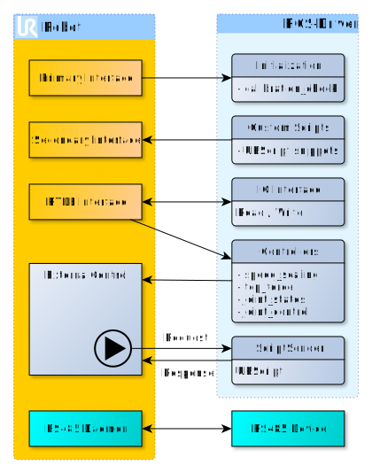

# ur_robot_driver

Este pacote contém o driver real para robôs UR. Ele faz parte do repositório *universal_robots_driver*
e requer outros pacotes desse repositório. Além disso, consulte o [README do repositório principal](../README.md) para obter informações sobre como instalar e iniciar este driver.

## ROS-API
A API ROS está documentada em um [documento independente](doc/ROS_INTERFACE.md).

## Detalhes técnicos
A imagem a seguir mostra uma visão geral muito grosseira da arquitetura do driver.

Ao se conectar à interface primária, o robô envia informações de versão e calibração que
são consumidas pelo *calibration_check*. Se a calibração relatada pelo robô não corresponder à
configurada (consulte [guia de calibração](../ur_calibration/README.md)), um erro será impresso no Roslog.

Os dados em tempo real do robô são lidos pela interface RTDE. Isso é feito automaticamente assim que
uma conexão com o robô pode ser estabelecida. Assim, os estados conjuntos e os dados de E/S estarão imediatamente
disponíveis.

Para realmente controlar o robô, um nó de programa do **Controle Externo** URCap deve estar em execução
no robô interpretando comandos enviados de uma fonte externa. Quando este programa não estiver em execução, nenhum
controlador movendo o robô estará disponível. Consulte o [guia de configuração
inicial](doc/installation/robot_setup.rst) sobre como instalar e iniciar isso no robô.

O URScript que estará em execução no robô é solicitado pelo nó de programa **Controle Externo**
do PC ROS remoto. O arquivo *ur_control.launch* do robô tem um parâmetro chamado `urscript_file` para
selecionar um programa diferente do padrão que será enviado como uma resposta a uma solicitação
de programa.

**Trechos de script personalizados** podem ser enviados ao robô com base em tópicos. Por padrão, eles irão
interromper outros programas (como o que controla o robô). Para um certo subconjunto de funções,
no entanto, é possível enviá-los como programas secundários. Veja [documentação UR](https://www.universal-robots.com/how-tos-and-faqs/how-to/ur-how-tos/secondary-program-17257/)
para mais detalhes.
 
**Observação para usuários do e-Series:**
O robô não aceitará código de script de uma fonte remota a menos que o robô seja colocado em
*modo de controle_remoto*. No entanto, se colocado em *modo de controle_remoto*, o programa que contém o nó de programa
**Controle externo** não poderá ser iniciado a partir do painel.
Para esse propósito, use os serviços do **painel** para carregar, iniciar e parar o programa principal
em execução no robô. Veja a [documentação ROS-API](doc/ROS_INTERFACE.md) para detalhes sobre os
serviços do painel.

Para usar a **interface de comunicação da ferramenta** em robôs e-Series, um script `socat` é preparado para
encaminhar a interface de comunicação da ferramenta do robô para um dispositivo local no PC ROS. Veja [o guia de configuração
de comunicação da ferramenta](doc/setup_tool_communication.rst) para detalhes.

Este driver está usando [ROS-Control](https://wiki.ros.org/ros_control) para quaisquer instruções de controle.
Portanto, ele pode ser usado com todos os controladores baseados em posição disponíveis no ROS-Control. No entanto,
recomendamos usar os controladores do pacotesem cabeçantrollers`**

## Uma observação sobre os modos
O termo **modo** é usado em significados diferentes dentro deste driver.

### Modo de controle remoto
Na série e, o próprio robô pode operar em diferentes modos de comando: pode ser no modo de **controle local**, onde o pingente de ensino é o único ponto de comando, ou no modo de **controle remoto**, onde
os movimentos do TP, iniciando e carregando programas do TP ativando o modo de condução livre são
bloqueados. Observe que o **modo de controle remoto** deve ser explicitamente habilitado nas configurações do robô
em **Configurações** -> **Sistema** -> **Controle Remoto**. Consulte o manual do robô para obter detalhes.

O **modo de controle remoto** é necessário para muitos aspectos deste driver, como
* modo headless (veja abaixo)
* envio de código de script para o robô
* muitas funcionalidades do painel, como
  * reinicialização do robô após parada de proteção/EM
  * ligar o robô e liberar o freio
  * carregar e iniciar programas
* a ação `set_mode`, pois usa as chamadas do painel mencionadas acima

### Modo Headless
Dentro deste driver, há o modo **headless**, que pode ser habilitado ou não. Quando o
[modo headless](./doc/ROS_INTERFACE.md#headless_mode-default-false) é ativado, o código de script
necessário para controle externo será enviado diretamente ao robô quando o driver iniciar. Assim que
outro código de script for enviado ao robô, seja enviando-o diretamente por este driver ou
pressionando qualquer botão relacionado a movimento no teach pendant, o script será substituído por esta
ação e terá que ser reiniciado usando o serviço
[resend_robot_program](./doc/ROS_INTERFACE.md #resend_robot_program-std_srvstrigger). Se isso
for necessário, você verá a saída `Connection to robot dropped, waiting for new connection.`
do driver. Observe que pressionar "play" no TP não iniciará o controle externo novamente, mas
qualquer programa que esteja atualmente carregado no controlador. Este modo não requer que o URCap "External
Control" seja instalado no robô, pois o programa é enviado diretamente ao robô. No entanto,
recomendamos usar o modo não headless e aproveitar a ação `set_mode` para iniciar a
execução do programa sem o teach pendant. O modo **headless** pode ser removido em versões futuras.

**Observação para a e-Series:** Para aproveitar o modo **headless** na e-Series, o robô deve
estar em **remote_control_mode** conforme explicado acima.

## controller_stopper
Um pequeno nó auxiliar que para e reinicia controladores ROS com base em um tópico de status booleano. Quando o status vai para `false`, todos os controladores em execução, exceto um conjunto de *consistent_controllers* predefinidos, são interrompidos. Se o status retornar para `true`, os controladores parados são reiniciados.
Isso é feito por meio da Assinatura de um tópico de estado em execução do robô. O ideal é que esse tópico seja travado e publique somente em alterações. No entanto, esse nó só reage em alterações de estado, então um estado publicado a cada ciclo também seria bom.
